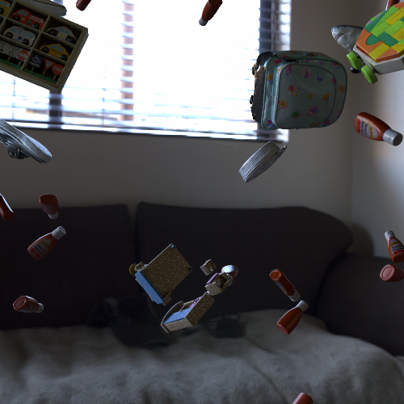

# UPDATES

- 11/01/2022: Added the possility to load a single object with `--path_single_obj`. Just give the direct path to the object. 
This function uses [nvisii.import_scene()](https://nvisii.com/nvisii.html#nvisii.import_scene). 
If the obj file is complex, it will break the object into sub components, 
so you might not have the projected cuboid, and you will get each pose of the different components with the cuboid. 
Be careful using this one, make sure your understand the implications. 
TODO: track the cuboid of the import_scene from nvisii.    


# Description

These sample scripts use [NViSII](https://github.com/owl-project/NVISII) to generate synthetic data for training the [DOPE](https://github.com/NVlabs/Deep_Object_Pose) object pose estimator. 
The data can also be used for training other networks.
To generate the data, you will need NVIDIA drivers 450 or above. 
We also highly recommend a GPU with RTX capabilities, as ray tracing can be costly on a non-RTX GPU. 

# Installation
```
pip install -r requirements.txt
```

## HDRI maps
You will need to download HDRI maps to illuminate the scene. These can be found freely on [polyhaven](https://polyhaven.com/hdris). 
For testing purposes, you can download a single one here: 
```
wget https://www.dropbox.com/s/na3vo8rca7feoiq/teatro_massimo_2k.hdr
mv teatro_massimo_2k.hdr dome_hdri_haven/
```


## Distractors

The script, as is, expects some objects to be used as distractors.  It is currently using the [Google scanned objects dataset](https://app.ignitionrobotics.org/GoogleResearch/fuel/collections/Google%20Scanned%20Objects), which can be download automatically with the following: 

```
python download_google_scanned_objects.py
```

If you do *not* want to use the distractors, use the following argument when running the script:  `--nb_distractors 0`.

# Running the script

If you downloaded everything from the previous steps, _e.g._, a single HDRI map and some distractors from Google scanned objects, you can run the following command:

```
python single_video_pybullet.py --nb_frames 1 --scale 0.01
```

This will generate a single frame example in `output/output_example/`. The image should be similar to the following: 



The script has a few controls that are exposed at the beginning of the file. 
Please consult `single_video_pybullet.py --help` for a complete list of parameters. 
The major parameters are as follows: 
- `--spp` for the number of sample per pixel, the higher it is the better quality the resulting image.  
- `--nb_frames` number of images to export.
- `--outf` folder to store the data. 
- `--nb_objects` the number of objects to load, this can reload the same object multiple times. 
- `--nb_distractors` how many objects to add as distractors, this uses 3D models from Google scanned objects. 

# Adding your own 3D models 

You can simply use `--path_single_obj` to load your own 3d model. But there are some limitations for exporting the meta data if the obj is complex. Try to have it as a single obj, e.g., not multiple textures, similar to the provided one in the repo. 

## Modifying the code to load your object

The script loads 3d models that are expressed in the format that was introduced by YCB dataset. 
But it is fairly easy to change the script to load your own 3d model, [NViSII](https://github.com/owl-project/NVISII) allows you to load different format 
as well, not just `obj` files. In `single_video_pybullet.py` find the following code: 

```python
for i_obj in range(int(opt.nb_objects)):

    toy_to_load = google_content_folder[random.randint(0,len(google_content_folder)-1)]

    obj_to_load = toy_to_load + "/google_16k/textured.obj"
    texture_to_load = toy_to_load + "/google_16k/texture_map_flat.png"
    name = "hope_" + toy_to_load.split('/')[-2] + f"_{i_obj}"
    adding_mesh_object(name,obj_to_load,texture_to_load,scale=0.01)
```
You can change the `obj_to_load` and `texture_to_load` to match your data format. If your file format is quite different, for example you are using a `.glb` file, then in the function `adding_mesh_object()` you will need to change the following: 

```python
    if obj_to_load in mesh_loaded:
        toy_mesh = mesh_loaded[obj_to_load] 
    else:
        toy_mesh = visii.mesh.create_from_file(name,obj_to_load)
        mesh_loaded[obj_to_load] = toy_mesh
```
`visii.mesh.create_from_file` is the function that is used to load the data, this can load different file format. The rest of that function also loads the right texture as well as applying a material. The function also creates a collision mesh to make the object move. 

# Handling objects with symmetries

If your object has any rotational symmetries, they have to be handled specially.

## Cylinder object

Here is a video that demonstrates what happens with a rotationally symmetric object if you do not specifiy the symmetries:

https://user-images.githubusercontent.com/320188/159683931-8e87f778-8711-4e54-9ad8-536cf5862e01.mp4

As you can see on the left side of that video, the cuboid corners (visualized as small colored spheres) rotate with the object. Because the object has a rotational symmetry, this results in two frames that are pixel-wise identical to have different cuboid corners. Since the cuboid corners are what DOPE is trained on, this will cause the training to fail.

The right side of the video shows the same object with a debug texture to demonstrate the "real" pose of the object. If your real object actually has a texture like this, it **does not** have any rotational symmetries in our sense, because two images where the cuboid corners are in different places will also not be pixel-wise identical due to the texture. Also, you only need to deal with rotational symmetries, not mirror symmetries for the same reason.

To handle symmetries, you need to add a `model_info.json` file (see the `models_with_symmetries` folder for examples). Here is the `model_info.json` file for the cylinder object:

```json
{
  "symmetries_discrete": [[1,  0,  0,  0,
                           0, -1,  0,  0,
                           0,  0, -1,  0,
                           0,  0, 0,   1]],
  "symmetries_continuous": [{"axis": [0, 0, 1], "offset": [0, 0, 0]}],
  "align_axes": [{"object": [0, 1, 0], "camera": [0, 0, 1]}, {"object": [0, 0, 1], "camera": [0, 1, 0]}]
}
```

As you can see, we have specified one *discrete* symmetry (rotating the object by 180° around the x axis) and one *continuous* symmetry (rotating around the z axis). Also, we have to specify how to align the axes. With the `align_axes` specified as above, the algorithm will:

1. Discretize `symmetries_continuous` into 64 discrete rotations.
2. Combine all discrete and continuous symmetries into one set of complete symmetry transformations.
3. Find the combined symmetry transformation such that when the object is rotated by that transformation,
    - the y axis of the object (`"object": [0, 1, 0]`) has the best alignment (smallest angle) with the z axis of the camera (`"camera": [0, 0, 1]`)
    - if there are multiple equally good such transformations, it will choose the obje where the z axis of the object (`"object": [0, 0, 1]`) has the best alignment with the y axis of the camera (`"camera": [0, 1, 0]`).

See below for a documentation of the object and camera coordinate systems.

With this `model_info.json` file, the result is the following:

https://user-images.githubusercontent.com/320188/159683953-0fe390ab-1d26-4395-ae15-352d360f3cd9.mp4

## Hex screw object

As another example, here's a rather unusual object that has a 60° rotational symmetry around the z axis. The `model_info.json` file looks like this:

```json
{
  "symmetries_discrete": [[ 0.5,   -0.866, 0,     0,
                            0.866,  0.5,   0,     0,
                            0,      0,     1,     0,
                            0,      0,     0,     1],
                          [-0.5,   -0.866, 0,     0,
                            0.866, -0.5,   0,     0,
                            0,      0,     1,     0,
                            0,      0,     0,     1],
                          [-1,      0,     0,     0,
                            0,     -1,     0,     0,
                            0,      0,     1,     0,
                            0,      0,     0,     1],
                          [-0.5,    0.866, 0,     0,
                           -0.866, -0.5,   0,     0,
                            0,      0,     1,     0,
                            0,      0,     0,     1],
                          [ 0.5,    0.866, 0,     0,
                           -0.866,  0.5,   0,     0,
                            0,      0,     1,     0,
                            0,      0,     0,     1]],
  "align_axes": [{"object": [0, 1, 0], "camera": [0, 0, 1]}]
}
```

The transformation matrices have been computed like this:

```python
from math import sin, cos, pi
for yaw_degree in [60, 120, 180, 240, 300]:
    yaw = yaw_degree / 180 * pi
    print([cos(yaw), -sin(yaw), 0, 0, sin(yaw), cos(yaw), 0, 0, 0, 0, 1, 0, 0, 0, 0, 1])
```

The resulting symmetry-corrected output looks like this:

https://user-images.githubusercontent.com/320188/159683969-33a46225-94c0-43d8-b888-5e702ae3c31a.mp4

## Final remarks on symmetries

This symmetry handling scheme allows the data generation script to compute consistent cuboid corners for most rotations of the object. Note however that there are object rotations where the cuboid corners become unstable and "flip over" to a different symmetry transformation. For the cylinder object, this is when the camera looks at the top or bottom of the cylinder (not shown in the video above). For the hex screw object, this is also when the camera looks at the top or bottom or when the rotation is close to the 60° boundary between two transformations (this can be seen in the video). Rotations within a few degrees of the "flipping over" rotation will not be handled well by the trained network. Unfortunately, this cannot be easily avoided.

Further note that specifying symmetries also improves the recognition results for "almost-symmetrical" objects, where there are only minor non-symmetrical parts, such as most of the objects from the [T-LESS dataset](https://bop.felk.cvut.cz/datasets/).


# Extra

This script is close to what was used to generate the data called `dome` in our NViSII [paper](https://arxiv.org/abs/2105.13962). 

If you use this data generation script in your research, please cite as follows: 

```latex
@misc{morrical2021nvisii,
      title={NViSII: A Scriptable Tool for Photorealistic Image Generation}, 
      author={Nathan Morrical and Jonathan Tremblay and Yunzhi Lin and Stephen Tyree and Stan Birchfield and Valerio Pascucci and Ingo Wald},
      year={2021},
      eprint={2105.13962},
      archivePrefix={arXiv},
      primaryClass={cs.CV}
}
``` 

# Training

You can either use the main training script ([`scripts/train.py`](https://github.com/NVlabs/Deep_Object_Pose/blob/master/scripts/train.py),
at least commit [9b509fa8](https://github.com/NVlabs/Deep_Object_Pose/commit/9b509fa842dbcb3c23858378b0d1cdfbbf29f235))
or the updated training script ([`scripts/train2`](https://github.com/NVlabs/Deep_Object_Pose/tree/master/scripts/train2)) with this data. 

# Dataset format

This section contains a description of the generated dataset format.

## Coordinate systems and units

All coordinate systems (world, model, camera) are right-handed.

The world coordinate system is X forward, Y left and Z up.

The model coordinate system is ultimately defined by the mesh, but if the model should appear "naturally upright" in its neutral orientation in the world frame, the Z axis should point up (when the object is standing "naturally upright"), the X axis should point from the "natural backside" of the model towards the front, the Y axis should point left and the origin should coincide with the center of the 3D bounding box of the object model.

The camera coordinate system is the same as in OpenCV with X right, Y down and Z into the image away from the viewer.

All pixel coordinates (U, V) have the origin at the top left corner of the image, with U going right and V going down.

All length measurements are in meters.

## Projected cuboid corners

The indices of the 3D bounding cuboid are in the order shown in the sketch below (0..7), with the object being in its neutral orientation (X axis pointing forward, Y left, Z up).

The order of the indices is the same as NVidia Deep learning Dataset Synthesizer (NDDS) and nvdu_viz from NVidia Dataset Utilities.

```text
   (m) 3 +-----------------+ 0 (b)
        /                 /|
       /                 / |
(m) 2 +-----------------+ 1| (b)
      |                 |  |
      |       ^ z       |  |
      |       |         |  |
      |  y <--x         |  |
  (y) |                 |  + 4 (g)
      |                 | /
      |                 |/
(y) 6 +-----------------+ 5 (g)
```
Debug markers for the cuboid corners can be rendered using the `--debug` option, with (b) = blue, (m) = magenta, (g) = green, (y) = yellow and the centroid being white.

## JSON Fields

Each generated image is accompanied by a JSON file. This JSON file contains the following fields:

* `camera_data`
    - `camera_look_at`: an alternative representation of the `camera_view_matrix`
    - `camera_view_matrix`: 4×4 transformation matrix from the world to the camera coordinate system. This is the inverse of `location_worldframe` + `quaternion_xyzw_worldframe`.
    - `height` and `width`: dimensions of the image in pixels
    - `intrinsics`: the camera intrinsics
    - `location_worldframe` and `quaternion_xyzw_worldframe`: see below

* `objects`: one entry for each object instance, with:
    - `bounding_box_minx_maxx_miny_maxy`: 2D bounding box of the object in the image: left, right, top, bottom (in pixels)
    - `class`: class name
    - `local_cuboid`: 3D coordinates of the vertices of the 3D bounding cuboid (in meters); currently always `null`
    - `local_to_world_matrix`: 4×4 transformation matrix from the object to the world coordinate system
    - `location` and `quaternion_xyzw`: position and orientation of the object in the *camera* coordinate system
    - `location_worldframe` and `quaternion_xyzw_worldframe`:  position and orientation of the object (or camera) in the *world* coordinate system
    - `name`: unique string that identifies the object instance internally
    - `projected_cuboid`: 2D coordinates of the projection of the the vertices of the 3D bounding cuboid (in pixels) plus the centroid. See section "Projected cuboid corners".
    - `provenance`: always `nvisii`
    - `segmentation_id`: segmentation instance ID; unique integer value that is used for this object instance in the `.seg.exr` file
    - `px_count_all`: number of pixels in the object silhouette without occlusions
    - `px_count_visib`: number of pixels in the visible part of the object silhouette, with occlusions
    - `visibility`: The visible fraction of the object silhouette (= `px_count_visib`/`px_count_all`). 
      Note that the object may still not be fully visible when `visib_fract == 1.0` because it may extend beyond the borders of the image.
      If run with `--no-visibility-fraction`, this field will always be set to `1`.
