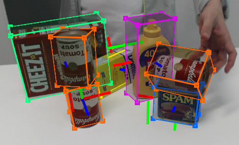

[](https://creativecommons.org/licenses/by-nc-sa/4.0/legalcode)

# Deep Object Pose Estimation - ROS Inference

This is the official DOPE ROS package for detection and 6-DoF pose estimation of **known objects** from an RGB camera.  The network has been trained on the following YCB objects:  cracker box, sugar box, tomato soup can, mustard bottle, potted meat can, and gelatin box.  For more details, see our [CoRL 2018 paper](https://arxiv.org/abs/1809.10790) and [video](https://youtu.be/yVGViBqWtBI).

*Note:*  The instructions below refer to inference only.  Training code is also provided but not supported. Thank you to [@Blaine141](https://github.com/blaine141) You can check out how to train DOPE on a single [GPU and using NVISII](https://github.com/NVlabs/Deep_Object_Pose/issues/155#issuecomment-791148200).



## Updates

2022/07/13 - Added a script with a simple example for computing the ADD and ADD-S metric on data. Please refer to [script/metrics/](https://github.com/NVlabs/Deep_Object_Pose/tree/master/scripts/metrics). 

2022/03/30 - Update on the NViSII script to handle [symmetrical objects](https://github.com/NVlabs/Deep_Object_Pose/tree/master/scripts/nvisii_data_gen#handling-objects-with-symmetries).  Also the NViSII script is compatible with the original training script. Thanks to Martin Günther. 

2021/12/13 - Added a NViSII script to generate synthetic data for training DOPE. See this [readme](https://github.com/NVlabs/Deep_Object_Pose/tree/master/scripts/nvisii_data_gen) for more details. We also added the update training and inference (without ROS) scripts for the NViSII paper [here](https://github.com/NVlabs/Deep_Object_Pose/tree/master/scripts/train2). 

2021/10/20 - Added ROS2 Foxy inference support through [Isaac ROS DOPE package](https://github.com/NVIDIA-ISAAC-ROS/isaac_ros_pose_estimation) for Jetson and x86+CUDA-capable GPU.

2021/08/07 - Added publishing belief maps. Thank you to Martin Günther. 

2020/03/09 - Added HOPE [weights to google drive](https://drive.google.com/open?id=1DfoA3m_Bm0fW8tOWXGVxi4ETlLEAgmcg), [the 3d models](https://drive.google.com/drive/folders/1jiJS9KgcYAkfb8KJPp5MRlB0P11BStft), and the objects dimensions to config. [Tremblay et al., IROS 2020](https://arxiv.org/abs/2008.11822).  The HOPE dataset can be found [here](https://github.com/swtyree/hope-dataset/) and is also part of the [BOP challenge](https://bop.felk.cvut.cz/datasets/#HOPE)

<!-- 2020/02/09 - Upgraded DOPE to use Python 3. Updated Dockerfile to use Python3-compatible ROS Noetic. The Python 2.7/ROS Kinetic is still available on the ['ros-kinetic' branch](https://github.com/NVlabs/Deep_Object_Pose/tree/ros-kinetic). -->

<!-- 2020/16/03 - Added a wiki (thanks to [@saratrajput](https://github.com/saratrajput))  -->

<!-- 2019/03/07 - ROS interface update (thanks to Martin Günther) -->

<!-- 2019/11/06 - Added bleach YCB weights  -->

## Installing

We have tested on Ubuntu 20.04 with ROS Noetic with an NVIDIA Titan X and RTX 2080ti with Python 3.8. The code may work on other systems.

---
***NOTE***

For hardware-accelerated ROS2 inference support, please visit [Isaac ROS DOPE](https://github.com/NVIDIA-ISAAC-ROS/isaac_ros_pose_estimation/tree/main/isaac_ros_dope) which has been tested with ROS2 Foxy on Jetson AGX Xavier/JetPack 4.6 and on x86/Ubuntu 20.04 with RTX3060i.

---

The following steps describe the native installation. Alternatively, use the provided [Docker image](docker/readme.md) and skip to Step #7.

1. **Install ROS**

    Follow these [instructions](http://wiki.ros.org/noetic/Installation/Ubuntu).
    You can select any of the default configurations in step 1.4; even the
    ROS-Base (Bare Bones) package (`ros-noetic-ros-base`) is enough.

2. **Create a catkin workspace** (if you do not already have one). To create a catkin workspace, follow these [instructions](http://wiki.ros.org/catkin/Tutorials/create_a_workspace):
    ```
    $ mkdir -p ~/catkin_ws/src   # Replace `catkin_ws` with the name of your workspace
    $ cd ~/catkin_ws/
    $ catkin_make
    ```

3. **Download the DOPE code**
    ```
    $ cd ~/catkin_ws/src
    $ git clone https://github.com/NVlabs/Deep_Object_Pose.git dope
    ```

4. **Install python dependencies**
    ```
    $ cd ~/catkin_ws/src/dope
    $ python3 -m pip install -r requirements.txt
    ```

5. **Install ROS dependencies**
    ```
    $ cd ~/catkin_ws
    $ rosdep install --from-paths src -i --rosdistro noetic
    $ sudo apt-get install ros-noetic-rosbash ros-noetic-ros-comm
    ```

6. **Build**
    ```
    $ cd ~/catkin_ws
    $ catkin_make
    ```

7. **Download [the weights](https://drive.google.com/open?id=1DfoA3m_Bm0fW8tOWXGVxi4ETlLEAgmcg)** and save them to the `weights` folder, *i.e.*, `~/catkin_ws/src/dope/weights/`.


## Running

1. **Start ROS master**
    ```
    $ cd ~/catkin_ws
    $ source devel/setup.bash
    $ roscore
    ```

2. **Start camera node** (or start your own camera node)
    ```
    $ roslaunch dope camera.launch  # Publishes RGB images to `/dope/webcam_rgb_raw`
    ```

    The camera must publish a correct `camera_info` topic to enable DOPE to compute the correct poses. Basically all ROS drivers have a `camera_info_url` parameter where you can set the calibration info (but most ROS drivers include a reasonable default).

    For details on calibration and rectification of your camera see the [camera tutorial](doc/camera_tutorial.md).

3. **Edit config info** (if desired) in `~/catkin_ws/src/dope/config/config_pose.yaml`
    * `topic_camera`: RGB topic to listen to
    * `topic_camera_info`: camera info topic to listen to
    * `topic_publishing`: topic namespace for publishing
    * `input_is_rectified`: Whether the input images are rectified. It is strongly suggested to use a rectified input topic.
    * `downscale_height`: If the input image is larger than this, scale it down to this pixel height. Very large input images eat up all the GPU memory and slow down inference. Also, DOPE works best when the object size (in pixels) has appeared in the training data (which is downscaled to 400 px). For these reasons, downscaling large input images to something reasonable (e.g., 400-500 px) improves memory consumption, inference speed *and* recognition results.
    * `weights`: dictionary of object names and there weights path name, **comment out any line to disable detection/estimation of that object**
    * `dimensions`: dictionary of dimensions for the objects  (key values must match the `weights` names)
    * `class_ids`: dictionary of class ids to be used in the messages published on the `/dope/detected_objects` topic (key values must match the `weights` names)
    * `draw_colors`: dictionary of object colors (key values must match the `weights` names)
    * `model_transforms`: dictionary of transforms that are applied to the pose before publishing (key values must match the `weights` names)
    * `meshes`: dictionary of mesh filenames for visualization (key values must match the `weights` names)
    * `mesh_scales`: dictionary of scaling factors for the visualization meshes (key values must match the `weights` names)
    * `overlay_belief_images`: whether to overlay the input image on the belief images published on /dope/belief_[obj_name]
    * `thresh_angle`: undocumented
    * `thresh_map`: undocumented
    * `sigma`: undocumented
    * `thresh_points`: Thresholding the confidence for object detection; increase this value if you see too many false positives, reduce it if  objects are not detected.

4. **Start DOPE node**
    ```
    $ roslaunch dope dope.launch [config:=/path/to/my_config.yaml]  # Config file is optional; default is `config_pose.yaml`
    ```


## Debugging

* The following ROS topics are published (assuming `topic_publishing == 'dope'`):
    ```
    /dope/belief_[obj_name]    # belief maps of object
    /dope/dimension_[obj_name] # dimensions of object
    /dope/pose_[obj_name]      # timestamped pose of object
    /dope/rgb_points           # RGB images with detected cuboids overlaid
    /dope/detected_objects     # vision_msgs/Detection3DArray of all detected objects
    /dope/markers              # RViz visualization markers for all objects
    ```
    *Note:* `[obj_name]` is in {cracker, gelatin, meat, mustard, soup, sugar}

* To debug in RViz, run `rviz`, then add one or more of the following displays:
    * `Add > Image` to view the raw RGB image or the image with cuboids overlaid
    * `Add > Pose` to view the object coordinate frame in 3D.
    * `Add > MarkerArray` to view the cuboids, meshes etc. in 3D.
    * `Add > Camera` to view the RGB Image with the poses and markers from above.

    If you do not have a coordinate frame set up, you can run this static transformation: `rosrun tf2_ros static_transform_publisher 0 0 0 0.7071 0 0 -0.7071 world <camera_frame_id>`, where `<camera_frame_id>` is the `frame_id` of your input camera messages.  Make sure that in RViz's `Global Options`, the `Fixed Frame` is set to `world`. Alternatively, you can skip the `static_transform_publisher` step and directly set the `Fixed Frame` to your `<camera_frame_id>`.

* If `rosrun` does not find the package (`[rospack] Error: package 'dope' not found`), be sure that you called `source devel/setup.bash` as mentioned above.  To find the package, run `rospack find dope`.


## YCB 3D Models

DOPE returns the poses of the objects in the camera coordinate frame.  DOPE uses the aligned YCB models, which can be obtained using [NVDU](https://github.com/NVIDIA/Dataset_Utilities) (see the `nvdu_ycb` command).

## HOPE 3D Models


We introduce new toy 3d models that you download [here](https://drive.google.com/drive/folders/1jiJS9KgcYAkfb8KJPp5MRlB0P11BStft). 
The folders are arranged like the YCB 3d models organization. 
You can buy the real objects using the following links 
[set 1](https://www.amazon.com/gp/product/B071ZMT9S2), 
[set 2](https://www.amazon.com/gp/product/B007EA6PKS), 
[set 3](https://www.amazon.com/gp/product/B00H4SKSPS), 
and 
[set 4](https://www.amazon.com/gp/product/B072M2PGX9). 

The HOPE dataset can be found [here](https://github.com/swtyree/hope-dataset/) and is also part of the [BOP challenge](https://bop.felk.cvut.cz/datasets/#HOPE).

## How to cite DOPE 

If you use this tool in a research project, please cite as follows:
```
@inproceedings{tremblay2018corl:dope,
 author = {Jonathan Tremblay and Thang To and Balakumar Sundaralingam and Yu Xiang and Dieter Fox and Stan Birchfield},
 title = {Deep Object Pose Estimation for Semantic Robotic Grasping of Household Objects},
 booktitle = {Conference on Robot Learning (CoRL)},
 url = "https://arxiv.org/abs/1809.10790",
 year = 2018
}
```

## License

Copyright (C) 2018 NVIDIA Corporation. All rights reserved. Licensed under the [CC BY-NC-SA 4.0 license](https://creativecommons.org/licenses/by-nc-sa/4.0/legalcode).


## Acknowledgment

Thanks to Jeffrey Smith (jeffreys@nvidia.com) for creating the Docker image.


## Contact

Jonathan Tremblay (jtremblay@nvidia.com), Stan Birchfield (sbirchfield@nvidia.com)
