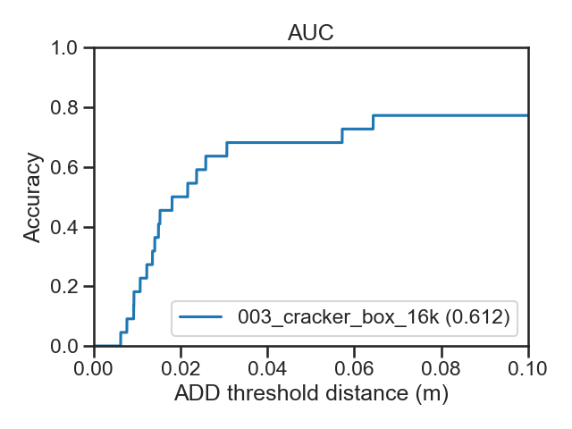
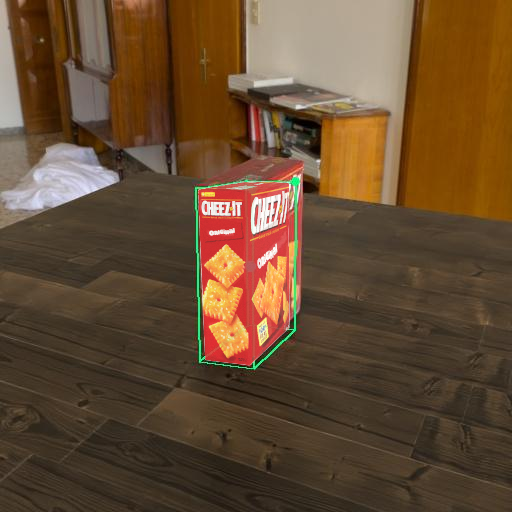

# ADD metrics computation and figure

## Requirements

Run the download content file: `./download_content.sh`, this downloads a simple scene with annotation rendered by NViSII and with DOPE predictions.

## How to run

If you downloaded the previous content you can execute the following: 

```
python add_compute.py
```
and you should get the following displayed:
```
mean 0.0208515107260977 std 0.016006083915162977 ratio 17/22
auc at  0.02 : 0.5
auc at  0.04 : 0.6818181818181818
auc at  0.06 : 0.7272727272727273
auc 0.6115249999999999
```
This means the area under the curve, *auc* from 0 cm to 10 cm is 0.61. This script also produces graphs such as: 



These are the metrics we reported in the original DOPE paper. I will refer to the paper for explaining the graph. 

## Assumptions
We make a few assumptions in this script. 
1. We assume the folders structures are the same and there are only scenes in the folder. See `data/` folder example from downloading the content. 
2. We assume the notation folder is in the opengl format and that it is using the nvisii outputs from the data generation pipeline. If you use a diffirent file format please update the script or your data. 
3. We assume the inferences are from DOPE inference, _e.g._, the poses are in the opengl format. These conventions are easy to change, _e.g._, look for the line `visii_gu.get_transform().rotate_around` in `add_compute.py` to change the pose convention.

If the script takes to long to run, please run with `--cuboid`, instead of using the 3d models vertices to compare the metric, it uses the 3d cuboid of the 3d model to compute the metric.

## 2D image-based metric

If you do not have a 3d model of your model and you would prefer to just measure the quality of your detections with a simple euclidean distance for the predicted keypoints. You can use `python kpd_compute.py`, this is very similar to `add_compute.py` and it behaves very similarly. 
The metric used here is the euclidean (L2) distance from predicted keypoint and the ground truth keypoint. Then we propose to use a threshold plot to evaluate the data, similar to the ADD metric. 

# Rendering 3d predictions using NViSII 



We added a script for you to add render of the 3d model to your predictions. 
```
# for scenes with DOPE inference
python render_json.py --path_json data/table_dope_results/scene1/00300.json --scale 0.01 --opencv --contour --gray
# for scenes generated by nvisii 
python render_json.py --path_json data/table_ground_truth/scene1/00100.json --scale 0.01 --contour --gray
```

`--gray` render the 3d model as a gray image and `--contour` adds the 3d model contour in green. 

## Rendering BOP format on images 

Using the same argument, you can use this script on the BOP annotation with 3d models. The script simply rebuilds the data structure that is needed to load the scene. 

```
python render_json.py --path_json /PATH/TO/hope_bop/hope_val/val/000001/scene_gt.json --bop --objs_folder /PATH/TO/hope_bop/hope_models/models/ --gray --contour --bop_scene 0
```

Only `--bop` is needed to be passed to load a bop scene. You can pass which scene you want to load with `--bop_scene`. The rest is the same behaviour. This was only tested on the HOPE data. 

## Assumptions 

We assume that you have the intrinsics stored in the camera data. If you do not have them, the script uses 512 x 512 with a fov of 0.78. If the camera data is complete, like with NViSII data, it will use the camera intrinsics. 

# TODO 
- Make a `requirement.txt` file. 
- Possibly subsamble vertices so computation is faster
<!-- - make a script to visualize the json files from DOPE -->
