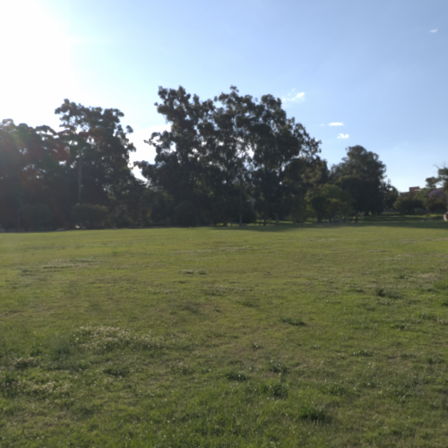

# Description

This uses NViSII to generate synthetic data for training DOPE. You will need a few things in order to generate the data. 
You need NVIDIA drivers 450 or above, and we highly recommend a GPU with RTX as ray tracing can be costly on a non RTX gpu. 

# Installation
```
pip install -r requirements.txt
```

## HDRI maps
You need to download HDRI maps to use to illuminate the scene. You can find some freely on [polyhaven](https://polyhaven.com/hdris). 
For testing purposes, you can download a single one here: 
```
wget https://www.dropbox.com/s/na3vo8rca7feoiq/teatro_massimo_2k.hdr
mv teatro_massimo_2k.hdr dome_hdri_haven/
```


## Distractors

If you want to run the script as is, it is expecting some object to be used as distractor, it is currently using the [google scanned dataset](https://app.ignitionrobotics.org/GoogleResearch/fuel/collections/Google%20Scanned%20Objects). You can download it automatically with the following: 

```
python download_google_scanned_objects.py
```

If you do *not* want to use the distractors, use the following argument when running the script, `--nb_distractors 0`.

# Running the script

If you downloaded everything from the previous steps, e.g., a single hdri map and some distractor from google scanned objects, you can run the following command,

```
python single_video_pybullet.py --nb_frames 1
```

This will generate a single frame example in `output/output_example/`. The image should be similar to the following: 



The script has few controls that are exposed at the beginning of the file. 
Please read along `single_video_pybullet.py` to see what is easy to change. 
The major ones are: 
- `--spp` for the number of sample per pixel, the higher it is the better quality the image will be.  
- `--nb_frames` number of images to export.
- `--outf` folder where to store the data. 
- `--nb_objects` controling the number of objects to load, this can reload the same object multiple times. 
- `--nb_distractors` how many objects to add as distractor, this uses 3d models from google scanned. 

# Adding your own 3d models 

The script as it is loads 3d model that are expressed in the format that was introduced by YCB dataset. 
But it is fairly easy to change the script to load your own 3d model, NViSII allows you to load different format 
as well, not just `obj` files. In `single_video_pybullet.py` find the following code: 

```python
for i_obj in range(int(opt.nb_objects)):

    toy_to_load = google_content_folder[random.randint(0,len(google_content_folder)-1)]

    obj_to_load = toy_to_load + "/google_16k/textured.obj"
    texture_to_load = toy_to_load + "/google_16k/texture_map_flat.png"
    name = "hope_" + toy_to_load.split('/')[-2] + f"_{i_obj}"
    adding_mesh_object(name,obj_to_load,texture_to_load,scale=0.01)
```
You can change the `obj_to_load` and `texture_to_load` to match your data format. If your file format is quite different, for example you are using a `.glb` file. 
In the function `adding_mesh_object()` you will need to change the following: 

```python
    if obj_to_load in mesh_loaded:
        toy_mesh = mesh_loaded[obj_to_load] 
    else:
        toy_mesh = visii.mesh.create_from_file(name,obj_to_load)
        mesh_loaded[obj_to_load] = toy_mesh
```
`visii.mesh.create_from_file` is the function that is used to load the data, this can load different file format. 

# To verify

- Verify that the data exported is compatible with the training script. 